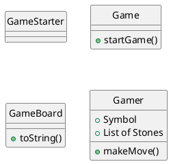
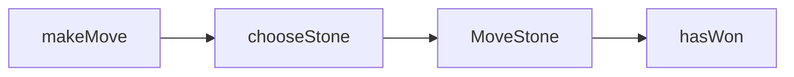
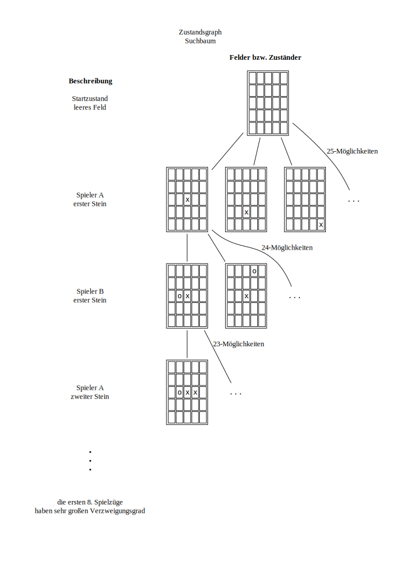
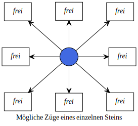
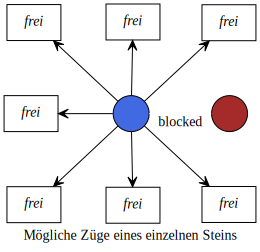

% Title: 
% Author: FG 
% Date: 2024-05-04 
--- 


# Aufgabe 


# Welches Spiel verwenden ?
- Teeko 

## Regel und ablauf

0. das spielfeld hat 5 mal 5 felder
1. Jeder spiele Hat 4 Stein 
   2. Benötigte objekte: spieler 1 + 2 , je 4 steine , ein spielfeld 
2. Gewonnen hat wer als erste eine reihe (horizonal, vertikal, diagonal) oder ein quadrat legt 
3. zuerst werden abwechselnd die steine aufs feld gebracht
4. danach wird abwechselnd gezogen, entweder horizontal, vertikal, oder diagonal
   5. aber nur auf leere Felder. 

## Wichtige funktionen 

Nach jedem Zug, prüfe hasWon 

vor jedem Zug, wähle einen stein, prüfe freie felder 


## Wie wählt man am besten ein leeres feld aus. 

- komplizierte regeln 
- oder
- Montecarlo 
  - Mach zufällige züge und wähle anhand der statistik 


## Wichtige Klassen 

Quellen: 
- PM1 





```java
// in der Game Klasse:


while(!currentGamer.hasWon()){
   
   if(currentGamer.equals(gamerA)){
      currentGamer = gamerB;
   }else{
      currentGamer = gamerA;
   }
   currentGamer.makeMove();
   GameBoard.print();
}

```

# Welche Methode? 

Baumsuche - Minimax - Monte Carlo Tree Search

=> Baumsuche : Abschätzung, nö eher nicht zu viele Kombination, zu Komplex 
=> eher ungünstig, weil es viele mögliche zielstände gibt
=> Der Startzustand ist immer der Selbe: das Leere Spielbrett 
=> Aber es gibt viele mögliche gewinn Kombination (Horizontale,Vertikale,Diagonale Reihe oder Quadrat)

Minimax oder MonteCarlo ?

## Welchen Verzweigungsgrad hat das Spiel ?



Zu beginn, also während der ersten 8 Züge hat das Spiel einen enormen Verzweigungsgrad. 
Ohne Rücksicht auf Symmetrien: $25!-(25-8)!=25!-17!=1.55\times10^{25}$ Kombinationen. 

Das Übersteigt erst mal meine Ambitionen. 






Nach den Ersten 8 Spielzügen reduziert sich der Verzweigungsgrad. 
Der Spieler darf einen Stein bewegen, solange dieser mindestens ein Freis nachbarfeld hat. 
Steine Dürfen horizontal, vertikal oder diagonal bewegen. 
Im Bestfall hat eine Stein somit 8 Möglichkeiten sich zu bewegen. 
Die Bewegungsfreiheit eines Steins wird aber durch die Spielfeldgröße und andere Steine eingeschränkt. 
Steine dürfen nur auf freie Felder ziehen.
Ein Stein kann 0 bis 8 Bewegungen zu je 4 Steinen ergibt sich rechnerisch ein
maximaler Verzweigungsgrad: $4 \times 8 = 32$. 
Dieser maximalwert kann aber nicht erreicht werden, das Sich die Vorhanden anderen Steine Blockieren. 


## Beschreibung des Minimax 
- Vorgehen (für Spieler A, wenn A gerade am Zug ist):
  - Der Suchbaum wird bis zu einer vorgegebenen Tiefe expandiert
    - Optional (wenn Suchbaum nicht zu groß): Der Suchbaum wird vollständig expandiert
  - Dabei entspricht jede Ebene einem Halbzug (d.h. Spieler A zieht oder Spieler B zieht)
  - Eine Bewertungsfunktion schätzt den Gewinn der Blatt-Zustände des Baums
    - Wenn Spiel gewonnen: z.B. +1 (Alternative: z.B. +∞)
    - Wenn Spiel verloren: z.B. −1 (Alternative: z.B. −∞)
  - Sonst: Bewertung mit z.B. Wert x mit −1 ≤ x ≤ +1
  - Von den Blättern zur Wurzel hoch wird jeweils
    - das Minimum nach oben weitergereicht, wenn B in der Ebene am Zug ist
    - das Maximum nach oben weitergereicht, wenn A in der Ebene am Zug ist


## Beschreibung MonteCarlo 

- Für jeden der möglichen Folgezüge:
  - Simuliere den Folgezug
  - Simuliere n Zufallsspiele bis zum Ende und speichere die Gewinnstatistik
- Führe genau denjenigen der Folgezüge aus, der die beste Gewinnstatistik aufweist

Funktioniert weil. 
- Zufallssimulation ist sehr schnell
  - Laufzeit ist unabhängig vom Verzweigungsfaktor
  - Lautzeit ist linear zu Spieldauer (Anzahl Züge bis zur Entscheidung)


